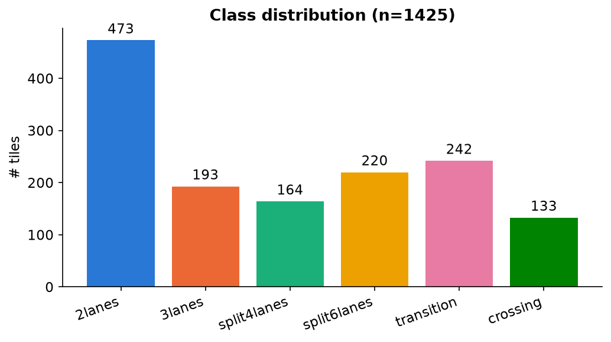
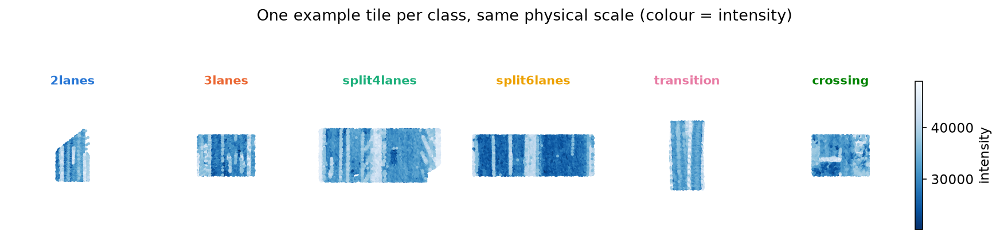
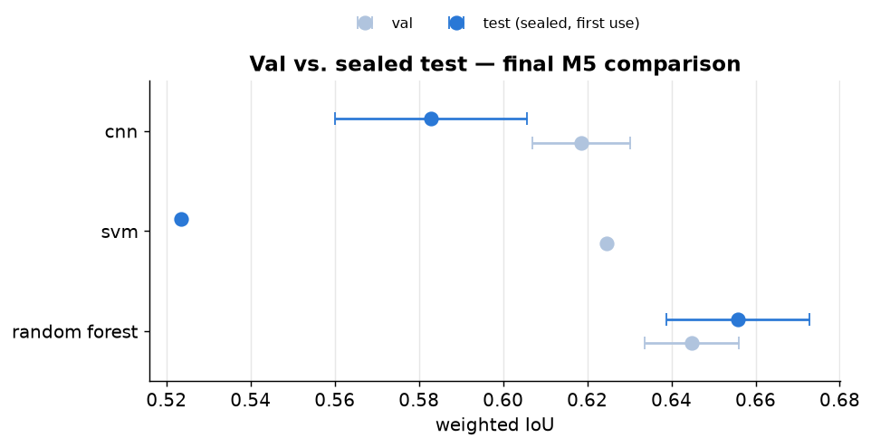
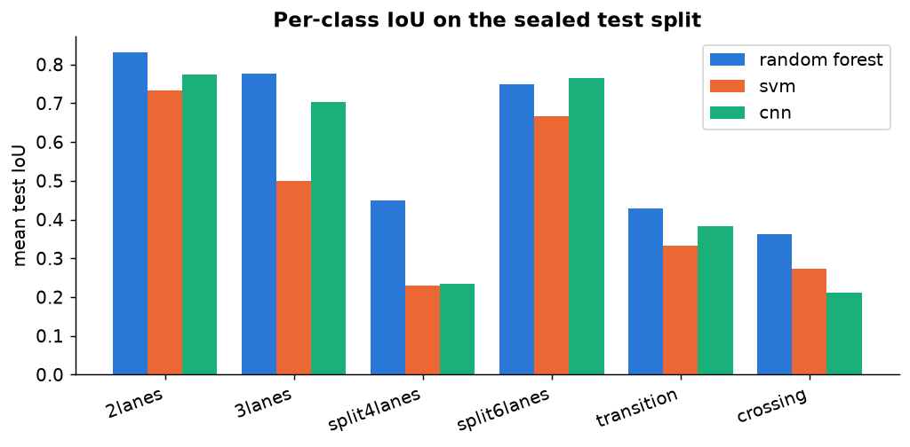

# Classification of Road Scenes from Airborne LiDAR Point Clouds

**Luis Jamora, Lukas Hammerschick**
Machine Learning for Civil Engineering — RWTH Aachen, Semester Project

---

## 1. Introduction

Airborne LiDAR scans of road networks can be automatically classified into scene types —
lane count, lane transitions, and crossings — as a building block for road-network
inventories that would otherwise require manual annotation. This project classifies
pre-cut road-block point clouds into six classes: `2lanes`, `3lanes`, `split4lanes`
(4 lanes, median > 2m), `split6lanes` (6 lanes, median > 2m), `transition`, and `crossing`.

Two structurally different approaches are built and compared: a classical pipeline of
hand-engineered per-cloud features feeding sklearn classifiers, and a bird's-eye-view (BEV)
occupancy-grid representation feeding a small convolutional network. Both are tuned,
measured for run-to-run reliability, and evaluated once on a sealed test split. The
codebase (`src/`) and the accompanying notebooks (`notebooks/00`–`06`) are the primary
record of this work; this document summarizes it.

## 2. Data and Exploratory Analysis

The dataset consists of 1425 road-block point clouds, pre-aligned with the driving
direction along the y-axis and with ground points already removed. Each point carries 22
features: local/global xyz, RGB, intensity, return count, four geometric descriptors
(planarity, linearity, sphericity, verticality), two along/across-track mean-intensity
grids, an edge-area measure, and an intensity-gradient position (`dataset/Features.txt`).

Class sizes are imbalanced roughly 3.6:1 between the largest and smallest class:

| `2lanes` | `3lanes` | `split4lanes` | `split6lanes` | `transition` | `crossing` |
|---|---|---|---|---|---|
| 473 | 193 | 164 | 220 | 242 | 133 |

The 80/15/5 train/val/test split is stratified by class and frozen once (`splits.json`,
`src/data.py::get_splits`) so every later milestone evaluates against the same held-out
data. Stratification is not a marginal choice on this dataset: comparing the frozen split
against 500 unstratified random splits, the worst-represented class in a 72-tile test split
has a median of only 5 tiles under random sampling, against the stratified split's
guaranteed 7 — 91% of random seeds do at least as badly as the stratified split's worst
case (`01_eda.ipynb` §5).

## 3. Methodology

Two encodings of the same point clouds are compared, following the project brief's
suggested first two approaches.

### 3.1 Feature-Vector Baseline

Each tile is reduced to a 123-dimensional vector: mean, std, and the 5/25/50/75/95th
percentiles of 17 raw columns, plus four explicit geometric features (`n_points`,
`x_range`, `y_range`, `point_density`). Absolute position (`global_x/y/z`) is excluded
deliberately — a classifier that latched onto map coordinates could fit these 1425 tiles
perfectly without learning anything transferable. `local_y` is excluded from the per-column
statistics because points sit near-uniformly along the driving direction within any given
tile regardless of class, so its distribution mostly re-encodes the tile's own `y_range`
rather than adding signal (`src/features.py`).

Random Forest and SVM are trained on this vector (`src/baseline.py`). Both are class-weighted
to counteract the imbalance in §2.

### 3.2 BEV Grid + CNN

Each tile is binned into a variable-size grid at a configurable cell resolution (default
0.3m), with three channels per cell: point density (log-compressed), mean height, and mean
intensity (normalized by the sensor's fixed 16-bit range, not by any statistic of this
dataset, so the normalization cannot leak train/val/test information). Grid extent is read
off each tile rather than cropped to a fixed window — `x_range` spans roughly 5–30m and
`y_range` roughly 2–25m across the training split, so a single fixed window would either
waste most of a typical grid on empty cells or crop the road out of the widest tiles
(`src/bev.py`).

`LaneCNN` (`src/cnn.py`) is a small, purpose-built network (~99K parameters, versus ~11.2M
for a from-scratch ResNet-18) of three pooling convolutional blocks followed by one
un-pooled convolution, then global adaptive average pooling and a linear classifier. Two
architectural choices are specific to this dataset:

- **Global adaptive pooling instead of a flatten layer**, so the network accepts any grid
  size without cropping or resizing.
- **GroupNorm instead of BatchNorm.** BatchNorm was measured to actively corrupt
  predictions here: since grids vary in size, batching more than one tile requires
  zero-padding to a common shape, and that padding is not inert — the norm layer's learned
  offset turns padded zeros into a non-zero activation that the next convolution mixes into
  real cells, changing 136 of 213 val predictions depending on which tiles happened to
  share a batch. Training therefore uses `batch_size=1`, which makes BatchNorm's
  batch-statistics/running-average split behave inconsistently between train and eval mode
  (measured: 0.662 vs. 0.127 val accuracy from identical weights). GroupNorm normalizes
  per sample and is unaffected by either problem.

Training uses a class-weighted `CrossEntropyLoss` and the checkpoint with the lowest val
loss (`src/train.py`), the same discipline as the baseline's class weighting.

### 3.3 Evaluation Metrics

Accuracy, precision, recall, and IoU (per-class and support-weighted) are computed directly
from the confusion matrix (`src/metrics.py`) rather than via a library call, and verified
once against `sklearn.metrics`'s own implementation (exact match). Weighted averaging
matters given the class imbalance in §2: unweighted averaging would let a 20-tile class move
the score as much as a 200-tile one.

## 4. Optimization

M4 tunes both approaches and, in the process, surfaces a methodological problem that
reframes everything measured up to that point: nothing had measured how much a result moves
when only chance varies. Holding the CNN's configuration and random seed fixed and changing
only the CPU thread count moved weighted IoU from 0.638 to 0.587 — floating-point
convolution reductions are not associative across thread counts, and 40 epochs of gradient
descent amplify the difference. Every subsequent CNN configuration is therefore re-run over
five seeds and reported as mean ± std, not as a single number.

**CNN search.** A staged coordinate search (`src/tune.py`) sweeps one axis at a time —
resolution, learning rate, channel depth/width, then data strategy — carrying each stage's
winner forward, rather than a 27+-run full grid that a 213-tile validation split could not
resolve meaningfully. Repeated over 5 seeds, only the resolution change survived: a
coarser 0.5m grid raised weighted IoU from 0.594 ± 0.031 (the M3 default, 0.3m) to
0.619 ± 0.012 — a real gain of about 0.025, smaller than the single-run comparison
suggested, but with less than half the run-to-run spread. Learning rate, channel
depth/width, and every data-strategy variant tested below all lost to the carried-forward
control.

**Baseline tuning.** Both sklearn models were tuned by manual, targeted search guided by
error diagnostics rather than an automated grid search, scored on val (10 seeds for the
forest; the SVM's decision boundary is deterministic, so one fit suffices):

| model | change | val weighted IoU |
|---|---|---|
| random forest | `n_estimators` 200→500, `max_features` `'sqrt'`→0.3 | 0.612 → 0.645 |
| svm | `C` 1→100, `gamma` `'scale'`→0.01 | 0.492 → 0.625 |

`max_features=0.3` was decisive for the forest: a feature-importance analysis found no
dominant feature (the top 20 of 123 carry only 0.34 of total importance), so sklearn's
default of offering each split only ~11 candidate features was discarding usable signal
across many weak columns. The SVM's default `C=1` was simply under-penalizing training
errors across six overlapping classes, not merely conservative — after tuning it became a
genuine competitor to the forest rather than the clear loser M2 reported.

**Rejected experiments.** Three changes, each independently well-motivated, were
implemented, measured, and reverted for not improving val performance:

- *Twelve "change along the road" features* (per-third `x_range`/`intensity_mean`/
  `point_share`, plus their spread across thirds), aimed at `transition` and `crossing` —
  the two classes whose label depends on the road changing along the tile, which no
  existing feature could express. The forest ranked one of these as its single most
  important feature of 135, yet val IoU *fell*, 0.612 → 0.596, losing on 7 of 10 seeds.
  High feature importance measures how often the forest chose to split on a noisy
  per-third statistic, not whether that split generalizes — a lesson that would have been
  missed by judging on importance or on a single seed.
- *Mirror augmentation* (label-preserving reflection across the road) and *weight decay*
  (1e-4), both targeting the CNN's overfitting (train accuracy 0.94 vs. val 0.77 at M3).
  Both narrowed the train/val gap as intended (0.093 → 0.083 and 0.088 respectively) without
  improving val IoU (0.606 ± 0.034 and 0.605 ± 0.025, against the 0.5m grid's 0.619 ± 0.012).
  The gap was a symptom of limited data, not of missing regularization.
- *Balanced subsampling* of the training set (0.572) lost to the class-weighted loss
  already in place — reweighting every tile beat discarding most of the majority class.

## 5. Results

The three M4-winning configurations — tuned random forest, tuned SVM, and the CNN at its
0.5m grid — are each evaluated on the sealed 72-tile test split for the first and only time
in this project (`src/final_eval.py`), with no further adjustment based on what test
returned. The forest and CNN are re-fit over the same seed counts as their val-side
measurement; the SVM once.

| model | val weighted IoU | test weighted IoU |
|---|---|---|
| **random forest** | 0.645 ± 0.011 (10 seeds) | **0.656 ± 0.017** (10 seeds) |
| svm | 0.625 (1 fit) | 0.523 (1 fit) |
| cnn (0.5m grid) | 0.619 ± 0.012 (5 seeds) | 0.583 ± 0.023 (5 seeds) |

The tuned random forest is 0.073 weighted IoU ahead of the CNN on test — a margin that
clears this project's own noise floor established in §4 (differences below ~0.06 are not
reliable). **The tuned random forest is the final model.**

`transition` and `crossing` remain the hardest classes for every model, consistent with
every earlier milestone. `split4lanes` is the one new pattern: weaker on test than
`transition` for every model, which never happened on val. With only 8 test tiles for this
class, a single misclassification moves its IoU by roughly 0.1 — read as sampling noise
from a small per-class test count rather than a new failure mode, consistent with the split
analysis in §2.

## 6. Discussion

**Why the forest won.** The CNN declined from val to test roughly as expected —
checkpoint selection by val loss is a mild, known source of optimism, and the honest test
number simply reflects that. The forest did not decline at all, within its own seed
spread. Neither result is surprising given the CNN's data budget: 1140 training tiles is a
lot fewer than convolutional architectures are usually given, and a 99K-parameter network
reaching only the same ballpark as 123 hand-engineered features on that budget suggests the
CNN's ceiling is set by data volume, not by architecture or by the hyperparameters M4 swept.

**The SVM's surprise.** The one result M4's own diagnostics could not have predicted: the
SVM's tuned `C=100` won decisively on val (0.492 → 0.625) but dropped to 0.523 on test — the
project's sharpest val-to-test decline. A high `C` trades away regularization for a tighter
fit to the training data, and the search that chose it was scored entirely against a
213-tile val split; nothing in that process could distinguish "generalizes well" from
"fits val well," because both look identical from inside the tuning loop. This is the
clearest concrete argument in the project for why a sealed test split has to exist, and why
it can only be used once — the M2 baseline's SVM would have looked like a strong
alternative to the forest by every number available before M5.

**Process.** Several of the numbers reported before M5 were quietly wrong in ways that
did not raise an exception: an epoch loss normalized by the wrong denominator, a confusion
matrix implementation whose correctness was only established by cross-checking sklearn, a
CNN result that depended on CPU thread count without anyone having measured that dependency.
None of these looked wrong — they looked like ordinary numbers. Where this project caught
them was either a targeted invariant test (`tests/test_train.py`, `tests/test_inference.py`)
or a repeated measurement over several seeds; a single plausible-looking run was not enough
in any of these cases.

## 7. Conclusion and Future Work

The tuned random forest — 500 trees, `max_features=0.3`, on the 123-dimensional
per-cloud feature vector — is this project's final model, at 0.656 ± 0.017 weighted IoU on
the sealed test split, ahead of both the tuned SVM (0.523) and the tuned BEV CNN
(0.583 ± 0.023) by a margin that clears the project's own measured noise floor. `transition`
and `crossing` remain the hardest classes throughout, for a structural reason neither
representation captures: their label depends on how the road changes along the tile, and
both the feature vector (tile-wide aggregates) and the current BEV channels (density,
height, intensity) discard exactly that.

The most likely paths to a stronger result, in the order this project's own findings
suggest testing them: more training tiles before more model capacity, given the CNN's
apparent data ceiling; BEV channels that encode along-track change directly rather than as
an aggregate (the feature-vector version of this idea was tried and rejected in §4, but a
per-cell rather than per-third encoding was not); and averaging the forest's predictions
across several seeds at inference time, which the seed-variance measurements in §4 suggest
would reduce test-time variance for a small but real gain.

A trained copy of the final model is persisted (`models/`, `src/inference.py`) for
evaluation against data outside this project — see the Appendix.

## Appendix: Reproducibility

The `src/` package is organized by responsibility rather than by milestone, since most
modules are used across several (see `ROADMAP.md`, "Where the code lives," for the full
mapping). `results/m4_tuning.json` and `results/m5_test_eval.json` record every run behind
§4 and §5 so the reported numbers are re-readable without re-running anything; the
frozen split is `splits.json`.

**Final model artifacts.** `src/inference.py::save_models` persists one trained copy of
each final model — `models/random_forest.joblib`, `models/svm.joblib`, `models/cnn.pt` —
fit the same way `final_eval.py` scored them (train split only; val still used internally
for the CNN's checkpoint selection), not retrained on train+val+test. `predict_new` loads a
saved model and predicts on an arbitrary folder of `.npy` tiles with no ground-truth labels
or class-folder structure required. `tests/test_inference.py` checks that a save/load round
trip reproduces the in-memory model's predictions exactly, so the artifact handed over is
provably the model the numbers in §5 describe.

**Notebooks.** `notebooks/01`–`06` contain the full derivation behind every claim in this
report, executed and with real output committed; `notebooks/00_project_summary.ipynb`
condenses all of them into the figures used here.
